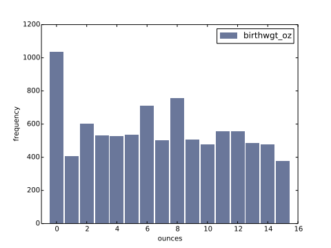

# Ch 2 — Distributions
book: downey2014-think-stats · pages: 37–50 (PDF; printed 17–30) · deck: ../decks/ch02.md

## Cues
- [x] C1 Histograms — what is the book's representation, and what would I have reached for in R (table())? → §2.1–2.2 · recite 2026-08-16 ✓
- [x] C2 (backlog Q2) What actually goes wrong when I drop "outliers" before analysis? → §2.5 · recite 2026-08-16 ✓
- [x] C3 (backlog Q4) When does a mean summarize honestly, and what do I do when it doesn't? → §2.7 · recite 2026-08-16 ✓
- [x] C4 What does chapter 2 already say about the first-babies question? → §2.6, §2.9 · recite 2026-08-16 ✓
- [x] C5 (backlog Q1) Effect size — what is it, and why report it instead of (or with) a p-value? → §2.9 · recite 2026-08-16 ✓ (Cohen's d pooled step wobbled — ch02-c007 at completion stage) · revise 2026-08-19 ✗ → retried ✓
- [x] C6 The four NSFG histograms — what shapes, and what do the shapes mean? → §2.4 · recite 2026-08-16 ✓

## Terms
| term | the book's definition (verbatim, p.) | field usage / contrast |
|---|---|---|
| distribution | "the values that appear in the dataset and how many times each value appears" (p.17) | ◆ the empirical distribution; the book drops the qualifier |
| histogram | "a mapping from values to frequencies, or a graph that shows this mapping" (p.29) | — |
| mode | "the most frequent value in a sample, or one of the most frequent values" (p.30) | — |
| effect size | "a summary statistic intended to describe… the size of an effect" (p.27) | — |
| clinically significant | "a result… that is relevant in practice" (p.28) | ◆ epi keeps this sharply apart from statistical significance; the book plants that flag a chapter early |

## Propositions
- A histogram is a complete description of a sample's distribution — the sample could be reconstructed from it, minus order (p.25).
- The four NSFG histograms each carry a story: birthwgt_lb bell-ish with a left tail; birthwgt_oz should be uniform but 0 spikes and 1/15 dip — respondents round near whole pounds; agepreg right-tailed with mode 21; prglngth piled on 39 with a long left tail (p.19–22).
- Outlier handling "depends on domain knowledge… and on what analysis you are planning to perform": below 10 weeks certainly errors, 10–30 ambiguous, above 30 probably real; this analysis keeps >27 weeks because the question concerns full-term births (p.22–23).
- Histograms compare two groups badly when group sizes differ — the fix (PMFs) is the next chapter's opening problem (p.24).
- Mean is one summary among several ("average" is the family); it describes a sample only when values cluster — the 100-pound mean pumpkin describes nothing (p.25–26).
- Variance S² = mean squared deviation, in square units — useful in calculation, poor as a summary; n vs n−1 deferred to ch. 8 (p.26).
- The first-babies answer so far: difference in means 0.078 weeks (13 hours), Cohen's d = 0.029 sd — tiny against the height-gap benchmark of 1.7 sd (p.27–28).
- Reporting is audience- and ethics-laden: persuade with a clear story, but acknowledge uncertainty and limitations (p.28).

## Argument
My reconstruction: the chapter walks one honest arc from "look at everything" to "summarize responsibly." Start with the complete object (the histogram), read shapes for mechanism — the ounce-part spike at 0 is my field's digit preference, a measurement artifact you'd miss with summary-first habits. Only then compress: means when values cluster, means-plus-spread when they don't, and never a bare mean for pumpkin-like data. The first-babies case shows the punchline: with n in the thousands you can *detect* a 13-hour difference that *means* nothing — so the honest summary is the effect size in units of spread (d = 0.029), not the headline difference. That is backlog Q1 half-answered already: report d with the raw difference; the p-value question is still ahead (ch. 9).

## Worked examples
### CohenEffectSize (p.27–28)
```python
def CohenEffectSize(group1, group2):
    diff = group1.mean() - group2.mean()
    var1 = group1.var()
    var2 = group2.var()
    n1, n2 = len(group1), len(group2)
    pooled_var = (n1 * var1 + n2 * var2) / (n1 + n2)
    d = diff / math.sqrt(pooled_var)
    return d
```
Annotations: the numerator is the plain difference in means; the denominator is the *pooled* standard deviation — each group's variance weighted by its n, so the bigger group's spread counts more (this is the step I keep fumbling; it's a weighted mean of variances, nothing deeper). Result is in standard-deviation units, which is what makes 0.029 readable as "tiny" without knowing the units.

### Figure 2.2 — the rounding artifact (p.20)

> "Figure 2.2: Histogram of the ounce part of birth weight."

Figure 2.2 · p.20 of book.pdf. Expected uniform over 0–15; the spike at 0 and dips at 1 and 15 are respondents rounding to whole pounds (p.22).

## My questions
- Q1 (open) The book defers n vs n−1 to ch. 8 (p.26) — park it there; watch whether the estimation chapter connects it to bias the way I'd explain it to a student.
- Q2 (open) Cohen's d arrives as a point estimate with no uncertainty attached. How would I put an interval on d for the cohort write-ups where I'd actually use it? Candidate pass-3 material.

## Teach-back
### 2026-08-16 · closed-book
Look at the whole distribution before you compress it. Histograms show you shapes, and shapes have causes: birth weight's ounce part should be flat but spikes at zero because people round — that's digit preference, the same artifact I see in self-reported cohort data. Outliers aren't a cleaning step, they're a judgment call that depends on what you're asking; here, keep >27 weeks because the question is about full-term babies. Summaries: the mean is only honest when values cluster around it — no typical pumpkin, no meaningful mean. And the first-babies "effect" is real but microscopic: 13 hours, d about 0.03 standard deviations. The chapter's real lesson for me: with big n, detectability and importance come apart, so report the effect size.
#### Critique
Strong — mechanism given for the rounding spike and the >27-week cut. One flag, scope: **"digit preference" is your field's name — the book does not use it** (it says respondents "round off", p.22); kept, marked as yours (◆ in the Terms row). The pooled-variance step was absent from the teach-back and wobbled again at the 08-19 revise — ch02-c007 stays at completion stage; no new card needed, the existing one is aimed at exactly that step.

## Summary
Chapter 2 teaches distribution-first thinking: build the histogram, read its shape for mechanism (rounding artifacts, tails, modes), treat outliers as domain-knowledge decisions tied to the question, and only then summarize — mean and spread when they're honest, effect size when comparing groups. Its first-babies verdict is the book's thesis in miniature: a detectable difference of 13 hours, d = 0.029, is a finding about *detection*, not about babies. Reporting choices are framed as ethical acts: persuade clearly, acknowledge uncertainty.

## Links
> ◆ **Beyond the book · Source** — [Seeing Theory — Basic Probability & distributions](https://seeing-theory.brown.edu/) — interactive histograms and distribution visualizations; ten minutes here makes §2.4's shape-reading tactile.

- concept: [effect size](../../../concepts/effect-size.md)
