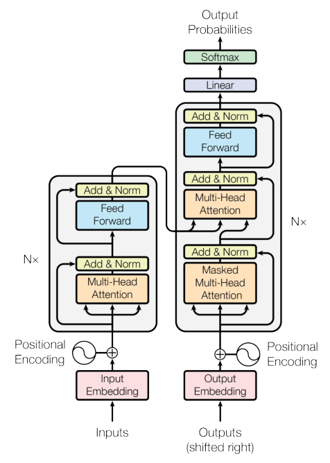

# Attention Is All You Need — Figure 1

> "Figure 1: The Transformer - model architecture."

Figure 1 · p.3 of paper.pdf

## What it shows

Two vertical processing stacks drawn side by side, data flowing bottom to top. The left stack: "Inputs" enter an "Input Embedding" box, a circled ⊕ adds "Positional Encoding" (marked with a sinusoid symbol), and the result enters a gray rounded block labeled "N×" containing, in order, "Multi-Head Attention", "Add & Norm", "Feed Forward", "Add & Norm". The right stack: "Outputs (shifted right)" enter an "Output Embedding" box, again ⊕ "Positional Encoding", then a taller gray "N×" block containing "Masked Multi-Head Attention", "Add & Norm", "Multi-Head Attention", "Add & Norm", "Feed Forward", "Add & Norm"; above it sit "Linear", then "Softmax", ending in "Output Probabilities". Two arrows leave the top of the left stack and feed into the right stack's middle "Multi-Head Attention" box. Around every attention and feed-forward box, a bypass arrow loops from the box's input directly into the following "Add & Norm".

## How to read it

- Left stack = the encoder, right stack = the decoder; the Transformer uses "stacked self-attention and point-wise, fully connected layers for both the encoder and decoder, shown in the left and right halves of Figure 1" (§3, p.3). Each gray block is one layer, repeated N× (N = 6 per §3.1, p.3).
- Read each stack bottom-up like a pipeline: words become vectors (embedding), position information is added on (the ⊕), and then each layer transforms the whole sequence at once.
- The bypass arrows into "Add & Norm" are the residual connections: each sub-layer's output is LayerNorm(x + Sublayer(x)) (§3.1, p.3) — the box's input is added back onto its output before normalizing.
- The two arrows crossing from encoder to decoder carry the encoder's output in as keys and values for the decoder's middle attention box, whose queries come from the decoder itself (§3.2.3, p.5) — that is where the output sequence consults the input sequence.
- "Masked" in the decoder's first attention box: positions may not look ahead — leftward-only information flow preserves the auto-regressive property (§3.2.3, p.5).

> ◆ **Beyond the paper · Personal** — A reading order that works: ignore the right half first. The encoder alone is "turn a sequence of words into a sequence of context-aware vectors." Then the decoder is an auto-regressive generator (like an AR model emitting one value at a time) that, at every step, gets to take a similarity-weighted look at those encoder vectors before emitting the next word.

Next: [Figure 2](fig-02.html)
