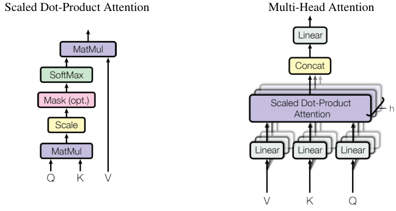

# Attention Is All You Need — Figure 2

> "Figure 2: (left) Scaled Dot-Product Attention. (right) Multi-Head Attention consists of several attention layers running in parallel."

Figure 2 · p.4 of paper.pdf

## What it shows

Two panels, each titled in the figure itself. Left panel, "Scaled Dot-Product Attention": three inputs enter at the bottom labeled Q, K, V. Q and K meet in a "MatMul" box; the result passes upward through "Scale", then "Mask (opt.)", then "SoftMax"; that output and V meet in a second "MatMul" whose arrow exits the top. Right panel, "Multi-Head Attention": V, K, Q each enter their own "Linear" box — every box drawn as a stack of h overlapping sheets — feeding a stacked "Scaled Dot-Product Attention" block annotated "h"; its outputs pass through "Concat" and a final "Linear".

## How to read it

- The left panel is eq. (1) drawn as a pipeline, bottom to top: the first MatMul computes the query–key dot products \(QK^{\top}\); "Scale" divides by \(\sqrt{d_k}\); "SoftMax" turns the scores into "the weights on the values" (§3.2.1, p.4); the second MatMul takes the weighted sum with \(V\). Term-by-term detail: [equation page](../equations/eq-01-scaled-dot-product.html).
- "Mask (opt.)" is used in the decoder's self-attention: illegal (future) positions are set to \(-\infty\) before the softmax, so they receive zero weight (§3.2.3, p.5). In the encoder the mask is simply not applied — that is the "(opt.)".
- The right panel wraps the left one: queries, keys, and values are linearly projected h times ("with different, learned linear projections", §3.2.2, p.4) — the sheets of the stacked boxes — the attention function runs on each projection in parallel, and the h outputs are concatenated and projected once more (§3.2.2, p.5). Here h = 8 (§3.2.2, p.5).

> ◆ **Beyond the paper · Personal** — Left panel in one sentence: compute similarity scores, standardize them, turn them into weights that sum to 1, take the weighted average — kernel smoothing with a learned similarity. The right panel then says: do that 8 times on 8 different learned projections of the same data, and pool (margin note [N0001](../notes.html#note-N0001)).

Prev: [Figure 1](fig-01.html)
